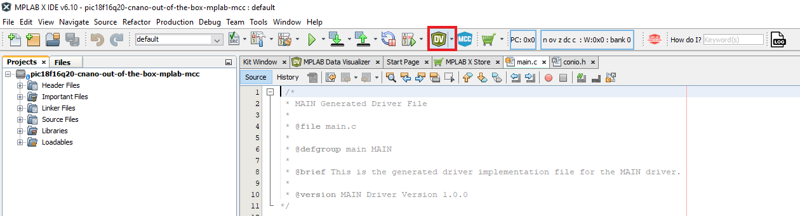

<!-- Please do not change this logo with link -->

# Curiosity Nano Out-of-the-Box Code using PIC18F16Q20 Microcontroller with MCC Melody
 

This project comes preloaded on the PIC18F16Q20 Curiosity Nano board and launches when the user first plugs it in. It consists of three programs and a command line that enables choosing between those programs.

- The first program is a simple LED blinking program. The microcontroller will start this first program when powered on out of the box.
- The second program turns on the existing on-board LED by pressing a button on the Curiosity Nano board.
- The third program sends an 8-bit counter through the Universal Asynchronous Receiver/Transmitter (UART) when the on-board button is pressed. This increases the counter.

The main program is changed by sending one of the numbers 1, 2 or 3 through UART interface. Any other key will return the menu.

## Related Documentation

For more details and code examples on the PIC18F16Q20 click on the following links:

- [PIC18F16Q20 Product Page](https://www.microchip.com/en-us/product/PIC18F16Q20?utm_source=GitHub&utm_medium=TextLink&utm_campaign=MCU8_MMTCha_pic18q20&utm_content=pic18f16q20-cnano-out-of-the-box-mplab-mcc-github&utm_bu=MCU08)
- [PIC18F16Q20 Code Examples on GitHub](https://github.com/microchip-pic-avr-examples?q=PIC18F16Q20)

## Software Used

- [MPLAB&reg; X IDE v6.1.5 or newer](https://www.microchip.com/en-us/tools-resources/develop/mplab-x-ide?utm_source=GitHub&utm_medium=TextLink&utm_campaign=MCU8_MMTCha_pic18q20&utm_content=pic18f16q20-cnano-out-of-the-box-mplab-mcc-github&utm_bu=MCU08)
- [MPLAB XC8 v2.45 or newer](https://www.microchip.com/en-us/tools-resources/develop/mplab-xc-compilers?utm_source=GitHub&utm_medium=TextLink&utm_campaign=MCU8_MMTCha_pic18q20&utm_content=pic18f16q20-cnano-out-of-the-box-mplab-mcc-github&utm_bu=MCU08)
- [MPLAB Code Configurator (MCC)](https://www.microchip.com/en-us/tools-resources/configure/mplab-code-configurator?utm_source=GitHub&utm_medium=TextLink&utm_campaign=MCU8_MMTCha_pic18q20&utm_content=pic18f16q20-cnano-out-of-the-box-mplab-mcc-github&utm_bu=MCU08)
- PIC18F-Q_DFP v1.22.416 or newer Series Device Pack
- MPLAB Data Visualizer

## Hardware Used
- [PIC18F16Q20 Curiosity Nano Evaluation Kit (EV73T25A)](https://www.microchip.com/en-us/development-tool/EV73T25A?utm_source=GitHub&utm_medium=TextLink&utm_campaign=MCU8_MMTCha_pic18q20&utm_content=pic18f16q20-cnano-out-of-the-box-mplab-mcc-github&utm_bu=MCU08)
  
- [Curiosity Nano Base for Click Boards&trade;](https://www.microchip.com/en-us/development-tool/AC164162?utm_source=GitHub&utm_medium=TextLink&utm_campaign=MCU8_MMTCha_pic18q20&utm_content=pic18f16q20-cnano-out-of-the-box-mplab-mcc-github&utm_bu=MCU08)

 

## Setup

The following peripheral and clock configurations are set up using MPLAB® Code Configurator (MCC) Melody for the PIC18F16Q20:

- **Clock Control:**
  - Clock Source: HFINTOSC
  - HF Internal Clock: 64_MHz
  - Clock Divider: 1
    
  

- **Configuration Bits:**
  - CONFIG5:
    - WDT operating mode: WDT Disabled; SEN is ignored
   

- **UART1:**
  - Requested Baudrate: 115200
  - Parity: None
  - Data Size: 8
  - Stop Bits: 1
  - Redirect Printf to UART: Enabled
  - UART PLIB Selector: UART1
    

- **UART1PLIB:**
  - Enable UART: Enabled
  - Enable Receive: Enabled
  - Enable Transmit: Enabled
    

- **Pin Grid View:**
  - UART1 RX1 input: RC5
  - UART1 TX1 output: RC4
  - GPIO input: RA2
  - GPIO output: RC7
    

- **Pins:**
  - RC5:
    - Module: UART1
    - Function: RX1
  - RC4:
    - Module: UART1
    - Function: TX1
  - RA2:
    - Function: GPIO
    - Direction: input
    - Custom Name: Button
    - Weak Pullup: Enabled
  - RC7:
    - Function: GPIO
    - Direction: output
    - Custom Name: LED
    

**Note:** 
  - Pin RA2 (Button) has weak pull-up enabled
  - UART1 is routed to CDC pins for more flexibility (TX1 = RC4, RX1 = RC5)

The following pin configuration must be made for this project:

|   Pin    | Configuration  | Function    |
| :------: | :------------: | :---------: |
|   RC4    | Digital output | UART1 TX    |
|   RC5    | Digital input  | UART1 RX    |
|   RC7    | Digital output | LED         |
|   RA2    | Digital input  | Button      |

## 2. Demo

### 2.1. LED Blink

The first program is a simple LED blinking program. The program is activated when the microcontroller is plugged in.
To run the first project, send the command `1` through UART using the Data Visualizer. After sending this command, the terminal will receive the following message: `"Program changed to blink LED"`.
  

### 2.2. Push the button to turn on the LED

The second program turns on the on-board LED by pressing the on-board button on the Curiosity Nano board.
To run the second project, send the command `2` through the UART using the Data Visualizer. After sending this command, the terminal will receive the following message: `"Program changed to press button to turn on LED"`.
  

### 2.3. Ramp on the Data Visualizer

While the on-board button is pressed, the third program sends an 8-bit counter through UART and increases the counter.
To run the third project, send the command `3` through the UART using the Data Visualizer Terminal window. After sending this command, the terminal will receive the following message:`"Program changed to press button to send a ramp through UART"`.

 

Follow the steps in the **How to use MPLAB Data Visualizer** section to set up the Data Visualizer. Switch to the Time Plot window and start streaming live data.  The plot will show the value of the counter which increases while the on-board button is pressed.  The demo below shows the result of holding down the button for 60 seconds.

  **Note:** The time plot shown is at 8x speed.

 

**Note:** By pressing any other key, the program returns the menu through UART using the software terminal.

## 3. Summary

This project is an out-of-the-box experience for the first-time user. It showcases the basic features of the Curiosity Nano Development platform.

## How to use MPLAB Data Visualizer

This section demonstrates how to set up and use the MPLAB X Data Visualizer to send commands and receive information.  These instructions are necessary to show the ramp results in the third part of the demo, however, these instructions can be used for any project where the MPLAB X Data Visualizer would be useful.

1. Open the software terminal in MPLAB X IDE. Left click on the **Data Visualizer** button.

 

2. Prepare settings in Data Visualizer.

- Left click on the specific serial port communication **COMx**
- Set the correct **Baud Rate**
- Select the right **Input Source**

 

3. Start using the programs. Press the **▶** COMx button. Left click on the **Line input**, type any key then press enter to send commands.

 

**Note:** The next steps will be followed to run the third program.

4. Prepare MPLAB Data Visualizer. Right click on the **Important files**, click **Add Item to Important Files...** .

 

**Note:** Step 5 will be followed only if there is no existing setup file for Data Visualizer. Otherwise go to Step 6.

5. Prepare MPLAB Data Visualizer.

- Click on the **Variable Streamers** tab, then press the **New...** tab.

 
- Type a specific **Variable Streamer Name**
- Choose **Ones' Complement** from the **Framing Mode** dropdown menu
- Type a specific value from the **Start of Frame**, press **Add a variable**
- Type a specific name for the variable name in **Variable Name**
- Press **Save**  
 

- Click on the **Save** button to save the settings as a dvws file.
 

- Name the file and save it as a **\*.dvws file**.
 

7. See the expected result on Data Visualizer.

- Select **RAMP_VALUE**, or name you gave your variable from Time Plot source list
   

- Click **Show Live Data** to begin streaming the communication from the serial port.
    

##  How to Program the Curiosity Nano board

This chapter shows how to use the MPLAB X IDE to program an PIC® device with an Example_Project.X. This can be applied for any other projects. 

- Connect the board to the PC.

- Open the Example_Project.X project in MPLAB X IDE.

- Set the Example_Project.X project as main project.

  - Right click on the project in the **Projects** tab and click **Set as Main Project**.
     

- Clean and build the Example_Project.X project.

  - Right click on the **Example_Project.X** project and select **Clean and Build**.
     

- Select the **PICxxxxx Curiosity Nano** in the Connected Hardware Tool section of the project settings:

  - Right click on the project and click **Properties**
  - Click on the arrow under the Connected Hardware Tool
  - Select the **PICxxxxx Curiosity Nano** (click on the **SN**), click **Apply** and then click **OK**:
     

- Program the project to the board.
  - Right click on the project and click **Make and Program Device**.
     

 

- [Back to Setup](#1-setup)
- [Back to Demo](#2-demo)
- [Back to Summary](#3-summary)
- [Back to Top](#curiosity-nano-out-of-the-box-code-using-pic18f16q20-microcontroller-with-mcc-melody)

